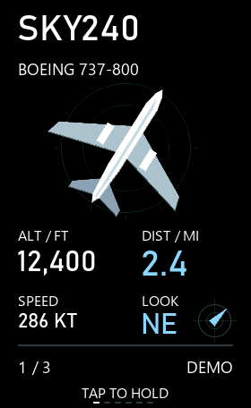
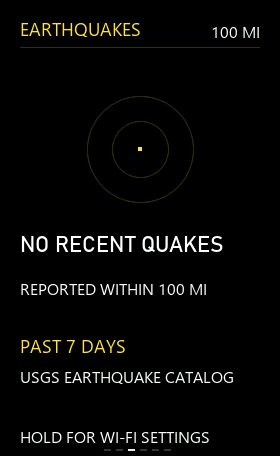
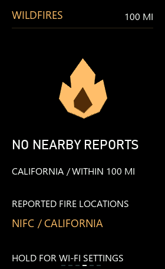
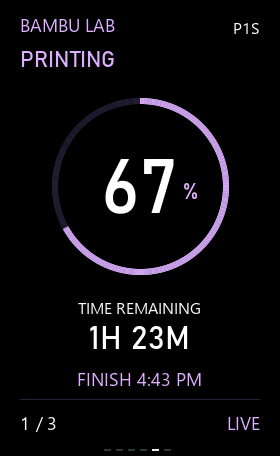
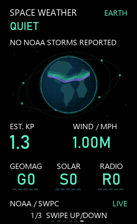

# Waveshare Widgets

Six optional widgets for the **Waveshare ESP32-S3-Touch-AMOLED-1.64 v2**. Choose the widgets you want, compile one sketch, and swipe between them. The project is an example you can modify; it does not require all six services.

| Widget | Data and setup | Screenshot |
| --- | --- | --- |
| Air traffic (`flight`) | ADSB.lol by default; optional local MeshPoint receiver |  |
| California gas (`gas`) | EIA; requires your own API key |  |
| Earthquakes (`earthquake`) | USGS; no key |  |
| California wildfires (`wildfire`) | NIFC; no key |  |
| Bambu P1S (`printer`) | Local printer; requires your printer's LAN details |  |
| Space weather (`space`) | NOAA SWPC; no key |  |

Screenshots are renderer captures with public, fictional, or location-neutral empty-state data. Live values and availability vary. The wildfire feed covers California. The printer example is designed for a P1S.

## Hardware and prerequisites

- Waveshare **ESP32-S3-Touch-AMOLED-1.64 v2**, USB data cable, and optionally a FAT32 microSD card.
- [Arduino IDE](https://www.arduino.cc/en/software/) with **esp32 by Espressif Systems 3.3.0**, or [Arduino CLI](https://arduino.github.io/arduino-cli/latest/installation/).
- A 2.4 GHz Wi-Fi network for live feeds. Offline or missing feeds show a clear setup, cached, or error state.

In Arduino IDE, open `firmware/WidgetDeck/WidgetDeck.ino` and select **ESP32S3 Dev Module** with these settings:

| Setting | Value |
| --- | --- |
| CPU frequency | 240 MHz |
| Flash size | 16 MB |
| Partition scheme | 16M Flash (3MB APP/9.9MB FATFS) |
| PSRAM | OPI PSRAM |
| USB mode | Hardware CDC and JTAG |
| USB CDC on boot | Enabled |

Select the board's actual port and upload. Uploading replaces its current firmware. If upload does not enter download mode, hold BOOT, press and release RESET, then release BOOT and retry.

## Select and install widgets

All six are enabled when no local selection file exists. To select a subset in **Arduino IDE**, copy `firmware/WidgetDeck/src/widgets/widget_selection.example.h` to `widget_selection.h` in the same directory. Set each `DECK_ENABLE_*` value to `1` or `0`, leaving at least one enabled. The file is ignored by Git. Compile and upload the sketch.

With **Arduino CLI** on Windows PowerShell, install the ESP32 core, then build and optionally upload with `tools/build.ps1`:

```powershell
arduino-cli core update-index --additional-urls https://espressif.github.io/arduino-esp32/package_esp32_index.json
arduino-cli core install esp32:esp32@3.3.0 --additional-urls https://espressif.github.io/arduino-esp32/package_esp32_index.json
.\tools\build.ps1 -Widgets flight,earthquake,space
.\tools\build.ps1 -Widgets flight,earthquake,space -Port COM5
```

Use your board's port in place of `COM5`. `-Widgets` accepts any nonempty combination of `flight`, `gas`, `earthquake`, `wildfire`, `printer`, and `space`. It writes the ignored `widget_selection.h` file. Later builds without `-Widgets` retain that selection; pass a new list to change it. Swipe order follows the list in `src/widgets/registry.h`, independent of command order. The script uses `arduino-cli` on PATH, or pass `-ArduinoCli` with its executable path.

## Wi-Fi and location

Copy `sd-card/wifi.example.txt` to the **root of a FAT32 microSD card** as `wifi.txt`, and replace the Wi-Fi name and password. Insert the card and restart the display. Values are literal; do not add quotes. The firmware reads the card without formatting it and saves valid settings internally. An edited card file takes effect at the next boot. You can also long press the display, join the setup network and open `http://192.168.4.1` to set Wi-Fi and location. The setup password appears on the display.

The default location is **San Francisco city center, 37.7749, −122.4194**. Change `latitude`, `longitude`, and `radius_miles` in `wifi.txt` for your area. The aircraft radius defaults to 15 miles; earthquakes and wildfires use separate fixed 100-mile ranges. An already provisioned device may retain its previously saved location until you update it through the SD card or setup page. `wifi.txt` is ignored by Git.

## Brightness and optional night mode

**Night mode is off by default.** The display stays at 85% brightness, including before its clock synchronizes. To customize brightness, copy `firmware/WidgetDeck/display_settings.example.h` to `display_settings.h` in the same directory, edit the values, then rebuild and upload. The local settings file is ignored by Git.

| Setting | Default | Meaning |
| --- | --- | --- |
| `DECK_NIGHT_MODE_ENABLED` | `0` | Set to `1` to enable scheduled dimming. |
| `DECK_DAY_BRIGHTNESS_PERCENT` | `85` | Brightness outside the night interval, or all day when night mode is off. |
| `DECK_NIGHT_BRIGHTNESS_PERCENT` | `20` | Brightness during the night interval. |
| `DECK_TOUCH_BRIGHTNESS_PERCENT` | `100` | Temporary brightness after a screen touch at night. |
| `DECK_NIGHT_START_MINUTE` | `22*60+30` | Local start time, 22:30 by default. |
| `DECK_NIGHT_END_MINUTE` | `7*60` | Local end time, 07:00 by default. |
| `DECK_NIGHT_TOUCH_TIMEOUT_MS` | `30000` | Time after the last touch before dimming resumes. |

Brightness percentages must be 1–100; start and end are different minute values from 0–1439. The schedule uses `DECK_TIMEZONE` in `firmware/WidgetDeck/config.h`, which defaults to US Pacific time. Before the clock is known, enabled night mode uses the day brightness. Serial commands `display status`, `display test night`, `display test day`, and `display auto` show or test the configured schedule without changing the system clock. Enable night mode to see dimming during a test. The test override ends after two minutes.

## Optional service setup

### California gas: your own EIA key

Register for a free personal key on the [EIA Open Data registration page](https://www.eia.gov/opendata/register.php). EIA emails the key to the address you provide. Copy `firmware/WidgetDeck/secrets.example.h` to `secrets.h` in the same directory and set `GAS_EIA_API_KEY` to your key in quotes. Rebuild and upload. Without a key, the gas widget displays **ADD API KEY**. Keep `secrets.h` private; it is ignored by Git. No EIA key is included in this repository.

### Air traffic: public feed or MeshPoint

The **default is the original web-based ADSB.lol feed**. Select `flight`, provide Wi-Fi and location, and no ADS-B account or extra file is needed. The display queries nearby aircraft through HTTPS. The range is set by `radius_miles`. Public positions expire after 60 seconds and the screen identifies stale data.

To use a **local MeshPoint ADS-B receiver**, first start its ADS-B listener and enable a `viewer` account in MeshPoint. Copy `adsb.example.txt` to the display SD card root as `adsb.txt`; set the Pi's private IPv4 address, dashboard and receiver ports, and viewer password. Restart the display. MeshPoint data travels over local Wi-Fi, not Meshtastic radio. The widget polls the receiver's `data.json` and the dashboard status endpoint; it also uses ADSB.lol for optional aircraft identity metadata when internet is available. It does not substitute public positions when the local receiver is unavailable. The regional airport list used for automatic circling detection is Bay Area specific; update `sky_airports.h` if you need that feature elsewhere.

Alternatively, keep `adsb.txt` off the card and provision over USB after filling a private local copy:

```powershell
.\tools\configure-adsb.ps1 -Port COM5 -ConfigFile .\adsb.txt
```

The USB script does not print the password. To return to the public feed, apply an `adsb.txt` containing only `source=public` by SD card or USB. Keep filled `adsb.txt` private; it is ignored by Git.

### Bambu P1S printer

Copy `printer.example.txt` to the display SD card root as `printer.txt`, then enter your printer's local IP address, serial number, and eight-character **LAN access code** from the printer's network/device settings. This is not a Bambu account password. Restart the display. Printer and display must share a reachable local network. The widget reads status over encrypted local MQTT and does not send print controls. Keep filled `printer.txt` private; it is ignored by Git.

## Controls and extending the project

- Swipe left/right: switch enabled widgets. Long press: Wi-Fi and location settings.
- Swipe up/down: browse aircraft, earthquakes, wildfires, printer pages, or space weather pages.
- Tap: track an aircraft, pause a quake/fire slideshow, change printer page, or request gas/space refresh.
- Serial monitor at 115200 baud: `status`, `widget flight`, `widget gas`, `next`, `previous`, `sky live`, `sky demo`, and individual feed status/refresh commands.

To add a widget, implement `deck::Widget` from `src/core/widget.h` in a new directory under `src/widgets/`, then include and register it in `src/widgets/registry.h`. The registry controls swipe order. Shared drawing, location, network, and display services are under `src/core/`. Keep feed work off the UI loop and use the shared network mutex for concurrent fetches.

Contributors with [Zig](https://ziglang.org/download/) can run the host regression suite with `.\tools\test.ps1`. This runs bundled checks without needing private or live feed captures. Pass `-Zig` with the executable path if it is not on PATH.

The MIT license covers original code and documentation. See [third-party notices](THIRD_PARTY.md) for drivers, logos, data, and test dependencies.
